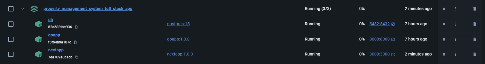

# Overview 
This is my second full-stack application. This time with completely different technologies.
I used Go, Typescript with Next.js, little bit of tailwind, PostgreSQL and my favorite Docker Compose.

The reason why I did this is because our property manager needed assistance collecting fees for building repairs
and I've decided to use the opportunity to create a coding project to keep track of who's paying.

It's far from production ready but I just had to get something up and running as fast as I can. I'll improve on it in the future.
The code that's on github uses the default postgres password but I'm running it on my machine with .env variables.

All three main services are on separate containers and also pushed to docker hub.

# Usage

