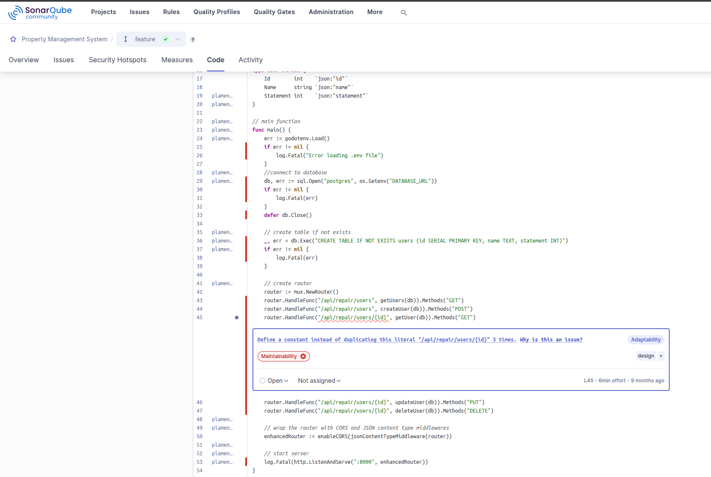
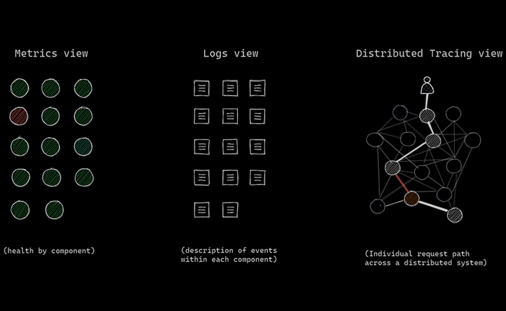

# Project Overview 
This is now my second full-stack application. But with a twist.

The reason why I did this is because our property manager needed assistance collecting fees for building repairs
and I've decided to use the opportunity to create a coding project to keep track of who's paying.

The application follows a three-tier architecture pattern (some would say it's even implementing a microservice approach but I wouldn't agree) with these key components:

* Backend Service in Go: RESTful API for data operations
* Frontend Service (Next.js): User interface with React components
* Database (PostgreSQL): Persistent data storage
* CI/CD Pipeline (Jenkins): Automated testing and deployment
* Observability Stack: Monitoring and logging

For the backend I tried to use modular structure as much as possible.
I have defined plenty of constants to avoid hardcoding values, which is a good practice for maintainability. I gotta mention this, even though it would come later in my documentation, that some of the code edits I did were as a result of *Sonarqube*'s suggestions:

Above is a sample screenshot of some of the advice their platform gave me after I implemented its functionality in my Jenkins pipeline. It's pretty neat if you get tired of your preferred AI agent's suggestions. So what I've changed because of Sonar is I constructed HTTP Header Constants, Error Message Constants and a MIME (Multipurpose Internet Mail Extension) Type Constant.

# Live Preview:

<video controls src="assets/Screencast from 31.03.2025 17_29_58.mp4" title="VIDEO"></video>

### The main function flow:

* Environment loading with godotenv
* Database connection and setup
* Router configuration
* API endpoint registration
* CORS middleware implementation
* Server startup

### API Endpoints:

* /health: Health check endpoint (The main reason I wanted to add this is because I wanted the backend to be as much Kubernetes-ready as possible)
* /api/repair/users: GET (all users) and POST (create user)
* /api/repair/users/{id}: GET, PUT, DELETE operations for specific users. Far from perfect but will come back and make it more modular after some time.

### Middleware:

* CORS enablement
* JSON content type setting

It's all far from production ready but I wanted to really focus on the infrastructure components later in another repository.

# The Continuos Integration Map of my Application

Below is a Figma diagram I made to illustrate all the bits and pieces that came into play on the surface level. 

# It All Started With Jenkins

As I was building my initial version of the pipeline I wanted to implement a secondary branch where the hypothetical dev, ops and QA teams can build and test new features and debug. I also wanted to create for them a nice pipeline to do so. Well, because GitHub can only send webhook payloads to a publicly accessible URL I needed to set-up:

* A fixed local IP via DHCP reservation, so my router always knew where Jenkins lived.
* Port forwarding from my router (ports 80 and 443) to my Jenkins machine.
* DuckDNS domain to point to my home’s dynamic public IP.
* Nginx reverse proxy to serve Jenkins at that domain with SSL.
* Let's Encrypt / Certbot to generate valid HTTPS certs (GitHub requires HTTPS for webhooks).

### Final result: 

### My goal was to create a smooth workflow like:

- Devs push code to GitHub.
- GitHub sends a webhook to Jenkins.
- Jenkins triggers my CI/CD pipeline (test, build, push Docker images, etc.).
- I get feedback in Jenkins and/or GitHub status checks.

My very last version of my Jenkins pipeline looked like this: 

120 Builds is an old number by the way.

- I have implemeneted parameters and environment variables to make the pipeline flexible and reduce hardcoded values.

- I leveraged Jenkins credentials binding for secure access to sensitive data (Docker tokens, GitHub API tokens) to adhere to security best practices.

- I fixed an issue where babel was interfering with the nextjs engine when building the dockerfile so I had to tinker with the babelrc config file and ultimately resolved the problem.

- I managed to set-up and run unit tests concurrently for both frontend and backend to minimize build time and improve efficiency. I had some issues with setting up the Cypress E2E test in headless mode as Jenkins runs are obviously a non GUI environment but I am so proud that I managed to crack it by installing the xvfb dependency which is an in-memory display server for a UNIX-like operating system.
Below is a screenshot of a local cypress run test I did in the beginning:

- The dynamic tagging of Docker images using parameterized version numbers ensures consistent and reproducible builds.This is me adding parameters for the builds if one day I decide to scrap the automatic run on push to feature approach:

- What my pipeline also does is it helps the hypothetical DevOps/Cloud team with infrastructure changes by automatating PR creation by creating a pull request to update the infrastructure repository with new and tested application code. This way I ensure that changes are manually reviewed and merged through a controlled process.

- Okay but why do I need PostgreSQL for SonarQube? Well, it's mainly for persistence and performance. Also, it requires a database in order to store the code analysis results, the quality metrics history, the user accounts and permissions and the project's configurations. Many people might object that I've configured SonarQube to use the same PostgreSQL instance as my application but in my defense SonarQube creates its own schema within my database and it keeps its tables separate from my application data. Also, it's all done in the dev stage of the SDLC so get off my ass. It has nothing to do with the production database. But anyway I've configured persistent volumes for SonarQube's data and logs and also I made sure that Sonarqube always starts after the db container to prevent errors. 

- Dynamic Branch and PR Naming: Functions that generate branch names and PR titles based on updated components definitely improve clarity and traceability.

- And finally I have the integrated code quality checks by running SonarQube as a Docker container, installing sonar-scanner locally and adding sonar-project.properties to my repo and wiring it into Jenkins pipeline.

- At the end I ensure that the workspace is cleaned up after each build and provides clear feedback on the build status.

- I really also wanted to mention that I have integrated into my pipeline a *Sonatype Nexus Repository*

 

It is really worth mentioning that my build time got reduced by about 20-25 seconds for such a small application like mine, compared to pushing to docker hub. Imagine that on scale? But because I later implemented ArgoCD it was far easier for me to switch to dockerHub because I think I had to set-up Image Updater but I am not quite sure yet how or if I even needed to do that. Anyway, it's very much worth sharing that with you.

# Who Is Carrying The Load?

My initial plan for the Load and Performance Testing was to set-up a complex JMeter -> influxDB/Prometheus -> Grafana pipeline but at that point I really wanted to move on and start building the infrastructure. I still did two simple stand-alone load tests.

### Parameters 

- I set it to 400 Number of Threads (Users) with a ramp-Up period of 120 seconds.

- The duration is 300 seconds (5 minutes).

- The path being /api/repair/users with a GET Method. The 404 Page is /test.

 

This is what a successful test looks like. There were 500 total requests. 250 for the "home page" and 250 for the 404 Page. I configured the assertion for to treat 404 as a successful response. The Average Response Time (ms) is:

- Home Page: 1.60

- Page Returning 404: 1.04

- Max Response Time: 27 ms

- Throughput: ~49.3 transactions/sec overall

Now, in the screenshot above I don't treat the /test path (404 Page) as a success so I get an APDEX Score of 0.000. The slightly higher throughput: ~80 TPS is maybe due to the shorter error-handling time.

# My Observability Set-Up

The last stage of my Continious Integration design was to create a relatively straightforward observability system. The tools I've used are as follows:

- Prometheus to scrape metrics
- Grafana Dashboards to visualize it all
- cAdvisor as a container-level system  (CPU, memory, disk, etc.)
- Loki as a log aggregation backend
- Promtail to Ship logs from all the Docker containers (including itself) to Loki

I really wanted to implement all three of the *three pillars of observability* pattern:

At the moment I am missing the distributed tracing piece in my stack. This can be implemented using tools like Jaeger or Zipkin but it could be done further down the line. A rough sketch of the idea looks something like this: 

- I add OpenTelemetry instrumentation to my Go backend
- Then implement a trace context propagation in my Next.js frontend
- After that I would deploy Jaeger or Tempo as my tracing backend

Now I'd like to talk about my current observability system and really emphasize on the importance of cAdvisor for getting those  granular container metrics which help identify performance bottlenecks and resource constraints. The image below is a screengrab from my cAdvisor dashboard which shows both user and kernel CPU usage over time, with several spikes - the most notable being around 10:57:10 UTC+2 where CPU usage peaked at about 0.15 cores.

Without cAdvisor I would lose almost all of my container-level metrics collection, resource usage statistics per container and hardware-level metrics like CPU throttling events. One thing that is independent from cAdvisor is my Go backend which reports directly to Prometheus via the: 

- job_name: "goapp"
  static_configs:
    - targets: ["goapp:8000"]

in the prometheus.yml file.

Now I would like to talk about my Grafana dashboard and how Promtail & Loki are aggregating logs across my distributed system.

These logs indicate that my SonarQube instance is successfully starting up, that all core components are initializing properly, my database connection is working, the quality profiles are being loaded successfully and my Loki query {container="/sonarqube"} is effectively filtering logs by:

* Container name label matching "sonarqube"
* Showing the last hour of data (based on my time range selection)
* Displaying approximately 262 log entries
* Performance Insights

If we were to analyze what these logs mean health-wise it would go something like this:

- a quick initialization time (most operations complete in milliseconds)
- Successful component loading (22 components identified)
- no error messages or warnings
- Total bytes processed: 43.6 kB

The Label browser in the image below also shows all my monitored containers:

and the final dashboard: 

I know what you're thinking - what the hell is going on with your cAdvisor? Okay, I think there could be a simple and fair explanation for that.

cAdvisor is constantly performing several resource-intensive tasks like:

- constant system calls and Docker API interactions.
- collecting CPU usage statistics, memory usage and limits, filesystem usage is not for free.
- processing all this raw data into meaningful metrics, involving calculations and aggregations for each container.

Looking at the memory usage section of my dashboard, we can see:

- cAdvisor using about 122-141 MB of memory
- SonarQube actually using the *most* memory (2.87 GB)

While other services using modest amounts:

- Prometheus: ~548 MB
- Grafana: ~258 MB
- PostgreSQL (db): ~73.3 MB

# Folder Structure

# Brief Demo of the Application

# Final Thoughts

I definitely learned a lot of aspects of the SDLC even though this was just a portfolio project. There are many more ways to improve and I am well aware of them but these kinds of undertakings have infinite ways to improve upon. After all it's a neverending process of constantly improving, optimizing and delivering. IN summary, this project was a very steep learning curve, one that many people would've given up on, but it was definitely worth it in order to understand only *half* the picture of being a good DevOps.

 